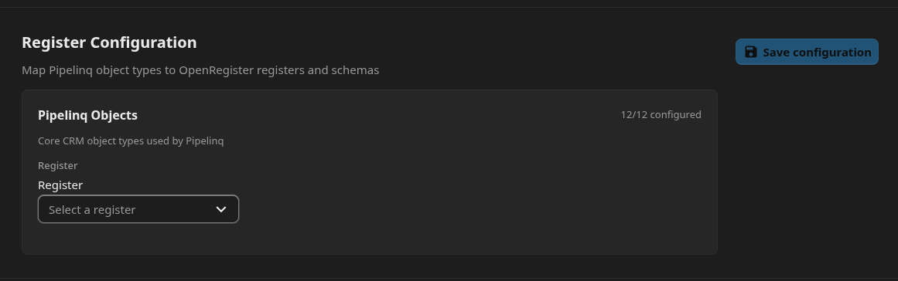
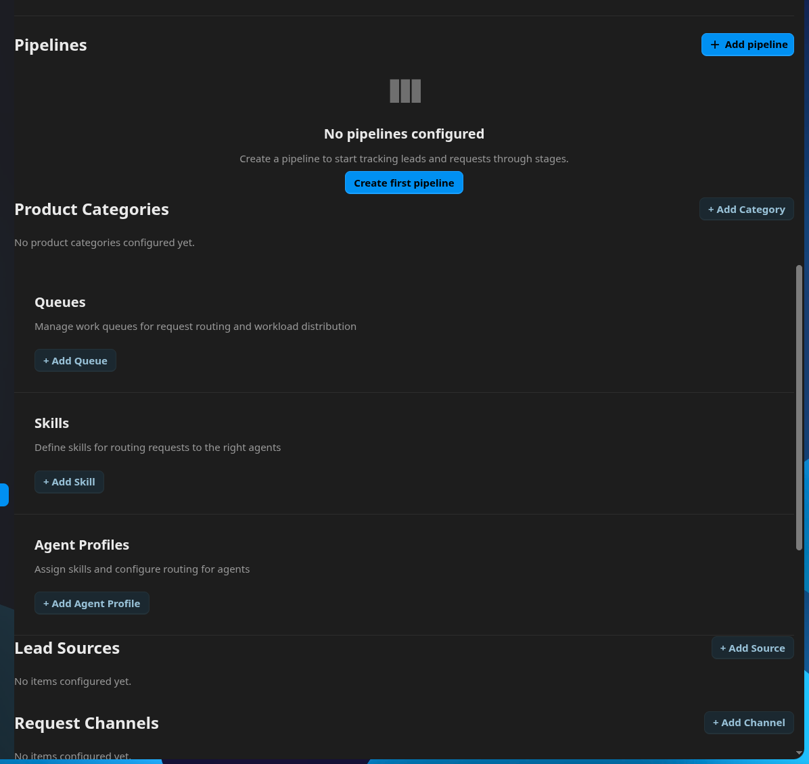
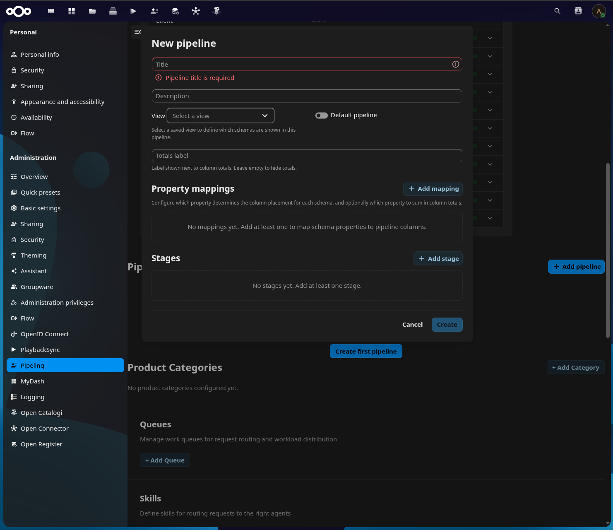
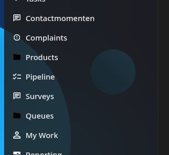
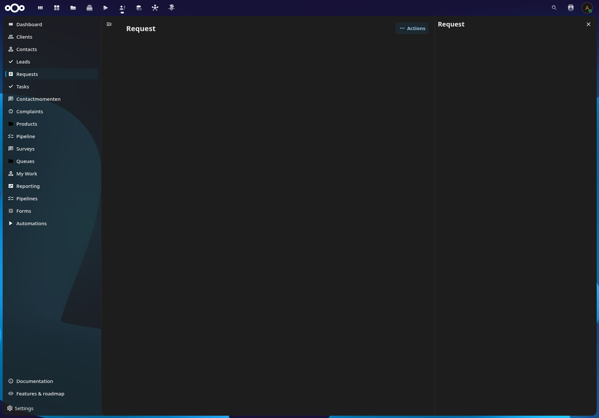
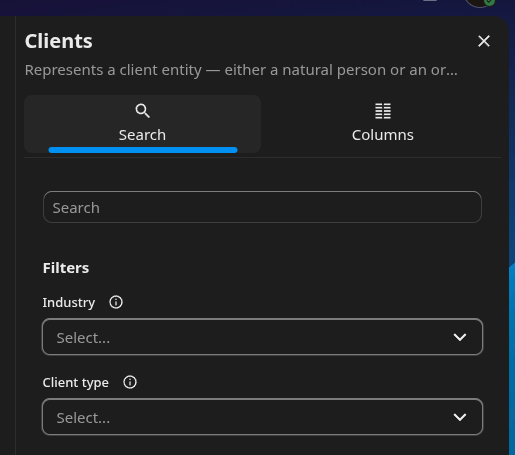

# PipelinQ issue log

Running tracker of issues found in the **pipelinq** app. Lightweight on purpose: each entry records that the issue exists, where (symptom, request, error, rough area), and — when the evidence supports it — what the bug is. No proposed fixes.

---

## PQ-001 — Admin settings API requests fail (missing web-root / `index.php` prefix)

- **App:** pipelinq
- **Status:** Open
- **Reported:** 2026-05-27

Opening and using pipelinq's admin settings fires requests that fail because the URLs are absolute `/apps/...` paths with no `/index.php/` (or instance web-root) prefix. Whether that prefix is required depends on the server configuration — some setups route `/apps/...` directly, others need the `index.php` front controller. `generateUrl()` is exactly what detects which case applies and builds the correct URL; bypassing it hardcodes one assumption, so on this instance the requests never reach Nextcloud's router and the webserver answers instead. GET requests come back **404**; a PUT to the same kind of un-prefixed path comes back **405** ("method not allowed") because the webserver won't accept that verb on what it treats as a static path — same root cause, different status.

> **The app is full of this issue — `generateUrl()` needs to be used everywhere API URLs are built.** It's pervasive and inconsistent (a few spots already use `generateUrl()`, most don't), spanning both the admin settings and the main app. The examples below are representative, not exhaustive; **this section will not be expanded with further instances.**

The cause is that the frontend hardcodes API paths as raw strings and passes them straight to `fetch()` instead of routing them through a webroot-aware helper. The admin settings screen has several such requests, coming from different places:

### Settings load — `GET /apps/pipelinq/api/settings`

```http
GET https://nextcloud.test/apps/pipelinq/api/settings
```

Built bare in pipelinq's own code: `fetch('/apps/pipelinq/api/settings', …)` in `src/store/modules/settings.js` (both the GET in `fetchSettings` and the POST in `saveSettings`). This is inconsistent within pipelinq — some calls already use `generateUrl()` correctly (e.g. `src/components/ActivityTimeline.vue`, `src/components/RoutingSuggestionPanel.vue`), while many do not, and the same raw-string pattern recurs across the `/apps/openregister/api/...` callers (`src/services/viewService.js`, `src/store/modules/leadSources.js`, `src/store/modules/requestChannels.js`, etc.).

### Re-import configuration button — `POST /apps/pipelinq/api/settings/reimport`

```http
POST https://nextcloud.test/apps/pipelinq/api/settings/reimport
```

Fired by the "Re-import configuration" button on the admin settings page. Built bare as `fetch('/apps/pipelinq/api/settings/reimport', …)` in `src/views/settings/Settings.vue` — same pipelinq-owned raw-string pattern as the settings load above.

### Lead Sources / Request Channels add — `POST /apps/pipelinq/api/settings/{lead-sources,request-channels}`

```http
POST https://nextcloud.test/apps/pipelinq/api/settings/lead-sources
POST https://nextcloud.test/apps/pipelinq/api/settings/request-channels
```

```json
{"name": "<content>"}
```

Adding a Source in the "Lead Sources" section, or a Channel in "Request Channels", on the admin settings page. Both store modules build the URL from a bare module-level constant — `API_BASE = '/apps/pipelinq/api/settings/lead-sources'` in `src/store/modules/leadSources.js` and `'/apps/pipelinq/api/settings/request-channels'` in `src/store/modules/requestChannels.js` — so every verb (GET list, POST add, DELETE) on these stores misses the prefix. (The 404 here also surfaces badly in the UI — see PQ-006.)

### Prospect Discovery "Save ICP settings" — `PUT /apps/pipelinq/api/prospects/settings` (405)

```http
PUT https://nextcloud.test/apps/pipelinq/api/prospects/settings
```

```json
{
    "employeeCountMin": 0,
    "employeeCountMax": 0,
    "provinces": [],
    "legalForms": [],
    "excludeInactive": true,
    "kvkApiKey": "",
    "openCorporatesEnabled": false,
    "sbiCodes": ["gfvfdfdsfgdg"],
    "keywords": []
}
```

Saving ICP settings under "Prospect Discovery" returns a **405** with the plain webserver message *"The requested method PUT is not allowed for this URL."* This is the same missing-prefix bug, not a verb mismatch: the backend route is registered correctly for PUT (`prospectSettings#update`, `'/api/prospects/settings'`, `verb => 'PUT'` in `appinfo/routes.php`), and `src/views/settings/ProspectSettings.vue` sends `method: 'PUT'` to a bare `'/apps/pipelinq/api/prospects/settings'`. Because the path lacks `/index.php`, the request never reaches Nextcloud's router — the webserver handles the un-prefixed path itself and rejects PUT on it with 405 (the message is the webserver's, not a Nextcloud JSON error). The GET load on the same screen (also bare, in `ProspectSettings.vue`) hits the 404 variant.

### Register/schema mapping — `GET /apps/openregister/api/registers?_extend[]=schemas`

```http
GET https://nextcloud.test/apps/openregister/api/registers?_extend[]=schemas
```

This one is **not** pipelinq's code. It is fired by the `CnRegisterMapping` component from the shared `@conduction/nextcloud-vue` library (rendered in `src/views/settings/Settings.vue` for the object-type → register/schema mapping). The bare `fetch()` calls live in the library at `nextcloud-vue/src/components/CnRegisterMapping/CnRegisterMapping.vue` (the registers list, and the per-id `registers/{id}?_extend[]=schemas` follow-up). Notably the library already ships a webroot-aware helper for exactly this — `prefixUrl()` in `nextcloud-vue/src/utils/headers.js`, used correctly in `useObjectStore.js` and `store/plugins/search.js` — but `CnRegisterMapping` doesn't use it. So fixing this endpoint means changing the shared library (which feeds all its consumer apps), not pipelinq.

Rough area: webroot-aware URL construction — pipelinq side in `src/store/modules/settings.js` and `src/views/settings/Settings.vue` (plus the wider raw-string callers listed above); library side in `@conduction/nextcloud-vue` `CnRegisterMapping.vue`.

---

## PQ-002 — Re-import doesn't refresh the register/schema mapping content

- **App:** pipelinq (defect in `@conduction/nextcloud-vue` `CnRegisterMapping`)
- **Status:** Open
- **Reported:** 2026-05-27

Pressing "Re-import configuration" on the admin settings page works on the backend, but the `CnRegisterMapping` panel only half-updates afterwards: the "X/X configured" count refreshes, while the actual content — the selected register and the per-type schema dropdowns/labels — does not. The result is a contradictory display like "12/12 configured" above a register field that still reads "Select a register".

The split happens because the count and the content read from different sources. `configuredCount()` counts non-empty values straight out of `localConfig`, which tracks the `configuration` prop via a deep+immediate watcher — so when re-import updates the parent's `config`, the count recomputes immediately. But the register/schema *options* (`registerSelectOptions` from `this.registers`, and `schemasByRegister`) are fetched only once in `mounted()` (`loadRegisters()`) and never reloaded when `configuration` changes. So `selectedRegister()` / `selectedSchema()` look up the freshly re-imported IDs against a stale options list, fail to resolve them, and fall back to the empty placeholder even though `localConfig` holds the value. There's no watcher or refresh path that re-runs `loadRegisters()` after a re-import (the parent's `reimport()` in `Settings.vue` updates `config` but never tells the component to reload its lists).



Rough area: `@conduction/nextcloud-vue` `nextcloud-vue/src/components/CnRegisterMapping/CnRegisterMapping.vue` — the `registers` / `schemasByRegister` lists loaded only in `mounted()` with no reload on `configuration` change; consumed in `Settings.vue` whose `reimport()` refreshes `config` only.

---

## PQ-003 — Post-setup settings sections have no horizontal margin (touch the edges)

- **App:** pipelinq
- **Status:** Open
- **Reported:** 2026-05-27

Once a register is set up, additional sections unlock on the admin settings page. Four of them render flush against the left/right edges with no side padding — their headers, "+ Add" buttons, and empty-state text (e.g. "No product categories configured yet") all touch the sides:

- **Pipelines** (and its "+ Add pipeline" button)
- **Product Categories** (and "+ Add Category" / "No product categories configured yet")
- **Lead Sources** and **Request Channels**
- **Prospect Discovery**

The inconsistency is in how each section wraps its content. The affected ones use a plain `<div>` root with no horizontal padding: `PipelineManager.vue` (`.pipeline-manager`), `ProductCategoryManager.vue` (`.category-manager`), `TagManager.vue` (`.tag-manager`, used for both Lead Sources and Request Channels), and `ProspectSettings.vue` (`.prospect-settings`, Prospect Discovery). Sibling sections that wrap in `NcSettingsSection` get Nextcloud's standard section padding for free, which is the inset these are missing.



Rough area: `src/views/settings/PipelineManager.vue`, `src/views/settings/ProductCategoryManager.vue`, `src/views/settings/TagManager.vue`, `src/views/settings/ProspectSettings.vue` (plain-div roots lacking the horizontal padding that the `NcSettingsSection`-wrapped siblings get).

---

## PQ-004 — "Add pipeline" uses a hand-rolled modal instead of `NcModal`

- **App:** pipelinq
- **Status:** Open
- **Reported:** 2026-05-27

The "Add pipeline" button opens a fully custom modal rather than Nextcloud's modal component. The dialog (`src/views/settings/PipelineForm.vue`) builds its own overlay from scratch — a `.pipeline-form-overlay` (`position: fixed`) wrapping a `.pipeline-form` panel — with no `NcModal` import anywhere in the file. The result is a bespoke modal that looks and behaves differently from the standard Nextcloud dialogs used elsewhere (focus handling, backdrop, sizing, close behaviour, styling).

Nextcloud ships `NcModal` from `@nextcloud/vue`, a fully customizable modal component, so the custom overlay is reinventing functionality the platform already provides.



Rough area: `src/views/settings/PipelineForm.vue` — custom `.pipeline-form-overlay` / `.pipeline-form` modal implementation in place of `NcModal`.

---

## PQ-005 — Object-backed settings sections fail: types not registered in the store

- **App:** pipelinq
- **Status:** Open
- **Reported:** 2026-05-27

On the **admin settings page**, any section that reads/writes OpenRegister objects through the object store fails, because the store has no object types registered there. Each failure comes as a pair — the save and the follow-up collection refresh — both rejecting the unknown type. Confirmed so far for **pipelines** and **product categories**, but it applies to every object-backed section on the page:

```
Error saving pipeline: Error: Object type "pipeline" is not registered in the store. Call registerObjectType('pipeline', schemaId, registerId) first.
Error fetching pipeline collection: Error: Object type "pipeline" is not registered in the store. Call registerObjectType('pipeline', schemaId, registerId) first.
```

```
Error saving productCategory: Error: Object type "productCategory" is not registered in the store. Call registerObjectType('productCategory', schemaId, registerId) first.
Error fetching productCategory collection: Error: Object type "productCategory" is not registered in the store. Call registerObjectType('productCategory', schemaId, registerId) first.
```

The object types are registered in `initializeStores()` (`src/store/store.js`), which calls `registerObjectType(<type>, config.<type>_schema, config.register)` for each type after loading settings. The problem is that the admin settings page is its own webpack entry, `src/settings.js`, which mounts `Settings.vue` directly and **never calls `initializeStores()`** (nor registers any types). So in the settings bundle the store starts empty, and the moment a section calls `objectStore.saveObject(<type>, …)` / `fetchCollection(<type>, …)` the store rejects the unknown type — `PipelineManager.vue` (`onSave`) and `ProductCategoryManager.vue` (`saveNew` / `fetchCategories`) are the two seen so far. The main app entry (`src/main.js`) does call `initializeStores()`, which is why object operations work there but not from the admin settings screen.

Rough area: `src/settings.js` (settings entry that mounts `Settings.vue` without initializing/registering store types), the type-registration in `src/store/store.js` `initializeStores()`, and the consumers `src/views/settings/PipelineManager.vue` and `src/views/settings/ProductCategoryManager.vue` (and any other settings section using the object store).

---

## PQ-006 — Lead Sources / Request Channels stores parse responses without checking status, then leave the error uncaught

- **App:** pipelinq
- **Status:** Open
- **Reported:** 2026-05-27

When adding a Lead Source or Request Channel fails at the network level (currently a 404, see PQ-001), the failure is reported as a misleading JSON parse error instead of being handled. The store action calls `await response.json()` straight after `fetch()` without first checking `response.ok`, so when the server returns an HTML error page (the 404 document) the parse blows up:

```
[Vue warn]: Error in v-on handler (Promise/async): "SyntaxError: Unexpected token '<', "<!DOCTYPE "... is not valid JSON"
  ---> <TagManager> at src/views/settings/TagManager.vue
         <Settings> at src/views/settings/Settings.vue
```

Two layers contribute. (1) `addSource()` in `src/store/modules/leadSources.js` (and `addChannel()` in `src/store/modules/requestChannels.js`) do `const data = await response.json()` with no `response.ok` guard, so any non-JSON error response becomes a `SyntaxError` rather than a meaningful error. (2) The component handler `saveNew()` in `src/views/settings/TagManager.vue` invokes the action without catching the rejection, so the promise rejects unhandled and Vue surfaces it as the warning above — the user gets no feedback and the rejection just lands in the console. Independent of the underlying 404, this pairing means real backend errors won't be shown to the user either.

Rough area: `src/store/modules/leadSources.js` / `src/store/modules/requestChannels.js` (`.json()` before any `response.ok` check) and `src/views/settings/TagManager.vue` (`saveNew` not catching the action's rejection).

---

## PQ-007 — Main app: Products and Queues nav icons render black (not themed)

- **App:** pipelinq
- **Status:** Open
- **Reported:** 2026-05-27

In the **main app** (not the admin settings), the left navigation menu shows the "Products" and "Queues" icons in black, so they don't match the themed (white) colour of every other menu icon.

These are the only two menu entries that use `"icon": "icon-files"` in `src/manifest.json`. The menu is rendered by `CnAppNav` (`@conduction/nextcloud-vue`), which resolves each entry's icon two ways: an `icon-` prefixed string is treated as a Nextcloud CSS icon class (`mdiIconComponent()` returns null for anything starting with `icon-`, so it falls to the `cssIconClass()` path on `NcAppNavigationItem`), while a bare name would map to a registered MDI component. Every pipelinq menu entry uses the CSS-class path, but `icon-files` is the one class that isn't being recoloured/inverted to white the way the sibling classes (`icon-comment`, `icon-category-organization`, `icon-user`, etc.) are — so it shows up in its default dark form.



Rough area: `src/manifest.json` — the `icon-files` class on the Products and Queues menu entries (rendered via `CnAppNav` / `NcAppNavigationItem`'s CSS-icon path, where that class isn't themed like the others).

---

## PQ-008 — Main app: "Pipeline Value" dashboard card navigates to a non-existent route (blanks the dashboard)

- **App:** pipelinq
- **Status:** Open
- **Reported:** 2026-05-27

On the **main app dashboard**, the stat cards (Open Leads, Open Requests, Pipeline Value) are each meant to link to a dedicated page. Open Leads and Open Requests work; clicking **Pipeline Value** shows nothing — the dashboard content goes blank instead of navigating anywhere.

The three KPI widgets differ only in their target route: `OpenLeadsKpiWidget.vue` → `{ name: 'Leads' }`, `OpenRequestsKpiWidget.vue` → `{ name: 'Requests' }`, `PipelineValueKpiWidget.vue` → `{ name: 'Pipeline' }`. `Leads` and `Requests` are real page IDs in `src/manifest.json` (routes `/leads`, `/requests`), but there is **no page with id `Pipeline`** — the pipelines page is id `Pipelines` (route `/pipelines`). (`Pipeline` exists only as a *menu entry* id, and that menu entry itself correctly routes to `Pipelines`.) Since routes are keyed off page IDs and `CnPageRenderer` matches `$route.name === page.id`, navigating to the name `Pipeline` matches no page and renders empty. The widget should target `Pipelines`.

Rough area: `src/views/dashboard/widgets/PipelineValueKpiWidget.vue` (`:route="{ name: 'Pipeline' }"` pointing at a non-existent route name; the real page is `Pipelines` in `src/manifest.json`).

---

## PQ-009 — Main app: dashboard refresh (both per-card and dashboard-wide) does nothing but spin

- **App:** pipelinq
- **Status:** Open
- **Reported:** 2026-05-27

On the **main app dashboard**, both refresh affordances spin and do nothing: the per-card "Refresh" in each content card's action menu (Requests by Status, Complaints, My Work, Client Overview), and the generic dashboard-wide refresh button in the page header. Clicking either spins the icon for a moment and then stops — no fetch request, no data refresh, no error. So it looks like it should be doing something while doing nothing at all, which is misleading.

**Per-card refresh.** The card action menu comes from the library wrapper `CnWidgetWrapper` → `CnActionsMenu` (`@conduction/nextcloud-vue`). Its Refresh has an "optimistic spin": when the host hasn't bound `:refreshing`, the icon just spins for `optimisticSpinMs` (default 800 ms) as immediate feedback, and the click emits a `@refresh` event / `cn:widget:refresh` bus message for the host to do the real work. pipelinq never wires that up — none of the dashboard widgets bind `:refreshing`, handle the refresh emit, or listen to the bus — so the per-card Refresh is left as a pure cosmetic spin.

**Dashboard-wide refresh.** The header button in `DashboardHeaderActions.vue` *attempts* real work but achieves nothing visible: `refresh()` calls `invalidateDashboardData()` (which is only `cache.clear()` — no refetch on its own) and then bumps the route query (`router.replace({ name, query: { …, _r: Date.now() } })`) as a "cheap trick" to remount every widget. That trick doesn't work here: the widgets read their data in `mounted()` and the shell's `<router-view>` (in `CnAppRoot`) isn't keyed on the route path/query, so changing only the query reuses the same component instances rather than remounting them. The cache is cleared but nothing re-fetches, and the button just spins for its 400 ms timeout.

Beyond the missing/ineffective wiring, showing a spin animation for an action that does nothing is misleading UX in its own right.

Rough area: pipelinq dashboard widgets (`src/views/dashboard/widgets/RequestsByStatusWidget.vue`, `ComplaintsWidget.vue`, `MyWorkWidget.vue`, `ClientOverviewWidget.vue`) don't handle the `CnWidgetWrapper` refresh (no `:refreshing` / `@refresh` / `cn:widget:refresh`); `src/views/dashboard/DashboardHeaderActions.vue` `refresh()` relies on a query-bump remount that doesn't remount (widgets fetch on `mounted()`, `CnAppRoot`'s `<router-view>` isn't path-keyed) plus `invalidateDashboardData()` that only clears a cache; optimistic-spin behaviour itself lives in `@conduction/nextcloud-vue` `CnActionsMenu` (`optimisticSpinMs`, default 800).

---

## PQ-010 — New Request / New Lead modals: `type="date"` on `NcTextField` is an invalid input type

- **App:** pipelinq
- **Status:** Open
- **Reported:** 2026-05-27

Opening the New Request modal (the "+ New Request" button on the main app dashboard → `RequestCreateDialog` → `RequestForm`) floods the console with `[Vue warn]: Invalid prop: custom validator check failed for prop "type"` on `NcTextField` / `NcInputField`. The "Requested at" field in `src/views/requests/RequestForm.vue` is declared as `<NcTextField … type="date" …>`, but `NcInputField` (which `NcTextField` wraps) only accepts the text-like input types — its `type` validator allows exactly `text, password, email, tel, url, search, number`. `date` isn't allowed, so the validator fails. Each render emits two warnings (one for `NcTextField`, one for the inner `NcInputField`), and the form re-renders several times while its `created()` fetches resolve, which is why the warning repeats.

The **New Lead** modal (`LeadCreateDialog` → `LeadForm`) has the identical problem: `src/views/leads/LeadForm.vue` declares its "Expected close date" field as `<NcTextField … type="date" …>` too.

`NcTextField` is the wrong component for a date input — Nextcloud ships dedicated date components for this (e.g. `NcDateTimePicker` / `NcDateTimePickerNative`). As-is the field won't render as a date picker and just warns.

Because Vue re-runs prop validators on every re-render, this warning also fires on **every field update** in the form (editing any field mutates reactive state → re-render → the `date` field re-validates). It's the same single offending field, not a per-field problem — the trace just points at wherever the update originated.

Rough area: the `type="date"` `NcTextField` in `src/views/requests/RequestForm.vue` ("Requested at") and `src/views/leads/LeadForm.vue` ("Expected close date") — unsupported by `NcInputField`'s type validator; should use a dedicated Nextcloud date component.

---

## PQ-011 — Object detail pages render completely empty (Requests, Leads, Clients, …)

- **App:** pipelinq
- **Status:** Open
- **Reported:** 2026-05-27

Opening an object detail page renders completely empty — no object data in the main area and an empty sidebar (just the type-name header). Confirmed for **Requests** (`/requests/{uuid}`), **Leads** (`/leads/{uuid}`) and **Clients** (`/clients/{uuid}`); the create flow for each succeeds and then lands on a blank detail page. This is a shared manifest-detail pattern, so it almost certainly affects every object detail page in the app (Contacts, Complaints, Products, etc.), not just these three. (Note: the create *modals* are a separate matter — the New Request / New Lead modals have their own bug in PQ-010, while the New Client modal is fine; but all three detail pages are empty regardless.)

A few things compound here:

- The detail pages are **not** rendered by the app's own `src/views/**/*Detail.vue` components (`RequestDetail.vue`, `LeadDetail.vue`, `ClientDetail.vue`) — those exist but are dead code (not registered in `customComponents.js`/`registry.js`, not referenced by the manifest). Each route is a manifest `type: "detail"` page in `src/manifest.json`, rendered by the library's `CnDetailPage` via `CnPageRenderer`.
- `CnPageRenderer` loads the detail object itself: it builds a context from the page `config` of `register: "pipelinq"` + `schema: "<type>"`, derives the object-type key `pipelinq-<type>` (`${register}-${schema}`), auto-registers that type and fetches the object by the route `:id`. But the rest of pipelinq registers and creates these objects under different identifiers — `registerObjectType('<type>', config.<type>_schema, config.register)` in `src/store/store.js` (a numeric schema ID and the configured register ID), and the create goes through `saveObject('<type>', …)`. So the detail page looks the object up by the literal manifest names (`pipelinq` / `request`|`lead`|`client`) rather than the IDs the object was actually created under — a strong candidate for the object never resolving, which would explain both the empty body and the empty sidebar. (The dashboard 404s in PQ-001 confirm the objects API is keyed by numeric register/schema IDs like `3/12`, not these names.)
- Even setting the load aside, the manifest detail `config`s define little-to-no main-content fields/stats — typically just a sidebar (and, for requests/leads, one deck-kanban widget) — so `CnDetailPage`'s main area has nothing configured to display regardless.

(There is no console error at all — the page just fails silently and renders empty. The above is the grounded reading from the manifest/config and the store registration, not a traced failure.)



Rough area: the `*Detail` page configs in `src/manifest.json` (register/schema names `pipelinq`/`<type>` vs the IDs used by `src/store/store.js` / `saveObject(…)`; plus minimal main-content config), rendered by `@conduction/nextcloud-vue` `CnPageRenderer` → `CnDetailPage`; the app's `src/views/**/*Detail.vue` components appear to be unused dead code.

---

## PQ-012 — Index pages share one list instance: the fetched object type "sticks" to the last-mounted page

- **App:** pipelinq (defect in `@conduction/nextcloud-vue` `CnPageRenderer` / `CnIndexPage`)
- **Status:** Open
- **Reported:** 2026-05-27

All the list pages (Clients, Contacts, Leads, Requests, Tasks, …) fetch from whichever one was opened first, not their own object type. Open Clients first and then Contacts/Leads/Requests all show client data. Navigating to a page with different rendering (the Dashboard, "My Work", etc.) and back "re-latches" it: go Dashboard → Leads and now every list page fetches leads. (This is also what made it look earlier as though Contacts and Clients "share" a data endpoint — they don't; their manifest configs are correctly distinct, `schema: "contact"` vs `"client"`.)

Two things combine:

- `CnPageRenderer` dispatches the page component with `<component :is="resolvedComponent">` and **no `:key`** bound to the route / page id. So when two pages share the same `type` (all the manifest `type: "index"` pages resolve to `CnIndexPage`), vue-router + Vue reuse the **same component instance** across the navigation and only update its props — the component is not remounted.
- `CnIndexPage`'s self-fetch binds its target **once, in `setup()`**: ``const objectType = `${props.register}-${props.schema}`​`` then `list = useListView(objectType, …)`. `setup()` runs once per instance, and nothing re-creates `useListView` (or re-derives `objectType`) when the `register`/`schema` props change. So on a prop-only navigation the list stays bound to the first page's type; its `$route.params` watch just calls `list.refresh()`, which re-fetches the *same* (stuck) collection.

Net: the fetched type only changes when `CnIndexPage` is actually remounted, which happens when you pass through a different-`type` page — hence the "remembered / last-used endpoint" behaviour. Both pieces live in the shared `@conduction/nextcloud-vue` library; pipelinq surfaces it because all its list pages are manifest-driven through `CnPageRenderer`.

Rough area: `@conduction/nextcloud-vue` `CnPageRenderer.vue` (dispatched `<component :is>` not keyed per route/page id) and `CnIndexPage.vue` (self-fetch `objectType` / `useListView` bound once in `setup()` with no re-bind on `register`/`schema` prop change).

---

## PQ-013 — Index sidebar: schema description is truncated with no way to read it

- **App:** pipelinq (defect in `@conduction/nextcloud-vue` `CnIndexSidebar`)
- **Status:** Open
- **Reported:** 2026-05-27

The list pages with a sidebar (Clients, Contacts, …) show the object's schema description under the sidebar title, but it's cut off to a single line with an ellipsis and there's no way to read the rest — no tooltip, no expand. For example the Clients schema description is the full sentence *"Represents a client entity — either a natural person or an organization. Mapped to Schema.org Person/Organization and vCard (RFC 6350) field conventions. Clients are the primary relationship entity in Pipelinq."*, but only *"Represents a client entity — either a natural person or an or…"* is visible.

The cause is that `CnIndexSidebar` feeds the full schema description into `NcAppSidebar`'s `:subname` (`resolvedSubname`, from `schema.description`). `NcAppSidebar`'s subname is meant for a short subtitle and renders as a single line truncated with ellipsis — fine for a few words, but it swallows a multi-sentence schema description, with no tooltip or expansion to recover the hidden text.



Rough area: `@conduction/nextcloud-vue` `CnIndexSidebar.vue` — the schema description passed as `NcAppSidebar`'s `:subname` (`resolvedSubname`), which truncates to one line with no full-text affordance.
