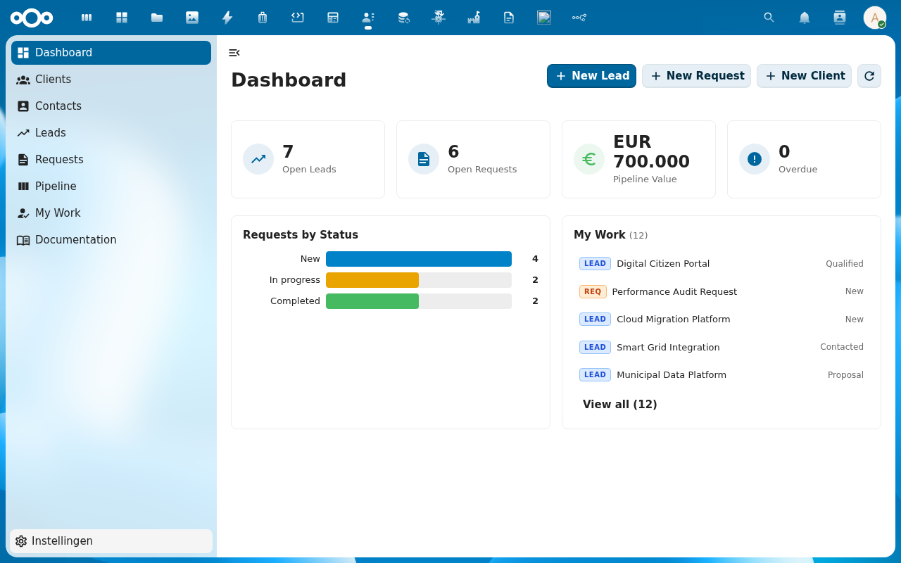
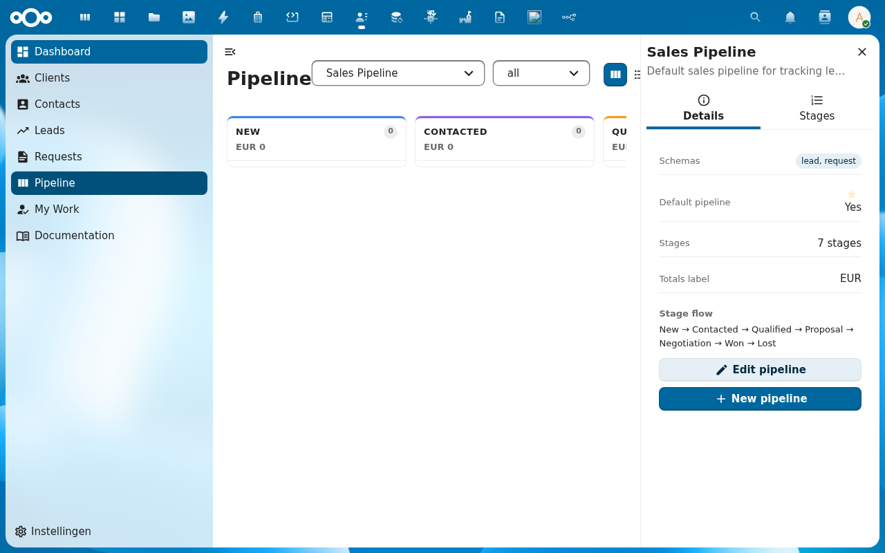
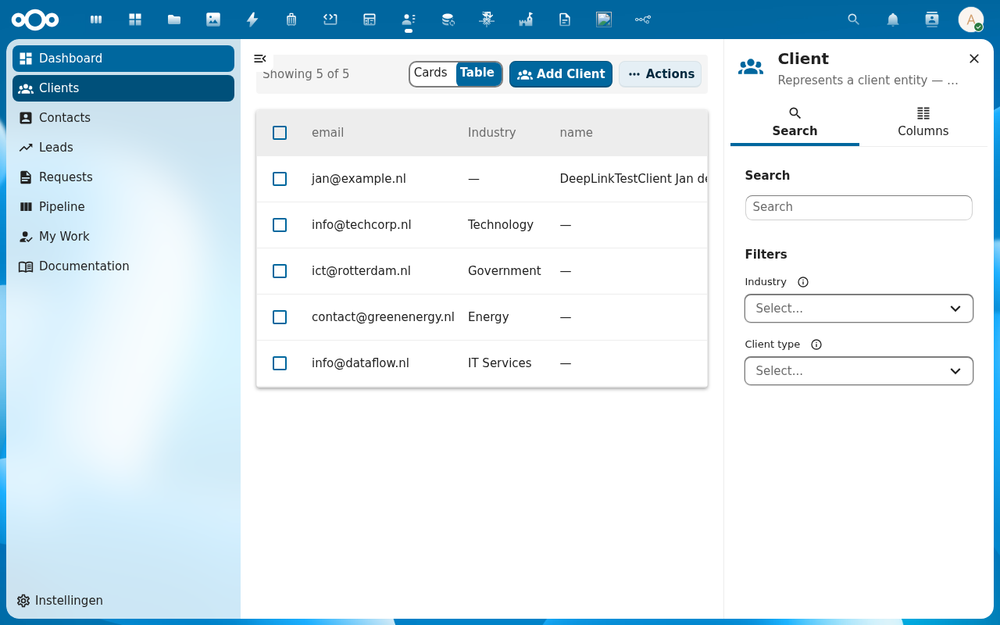
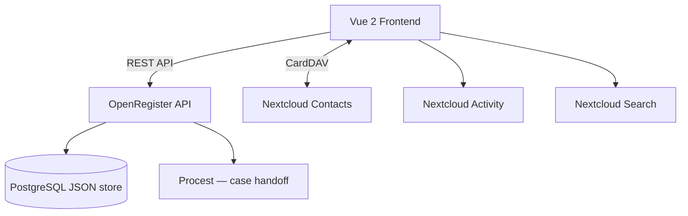

<p align="center">
  
</p>

<h1 align="center">Pipelinq</h1>

<p align="center">
  <strong>Lightweight CRM for Nextcloud — client management, lead pipelines, and request intake</strong>
</p>

<p align="center">
  <a href="https://github.com/ConductionNL/pipelinq/releases"></a>
  <a href="https://github.com/ConductionNL/pipelinq/blob/main/LICENSE"></a>
  <a href="https://github.com/ConductionNL/pipelinq/actions"></a>
  <a href="https://pipelinq.app"></a>
</p>

---

Pipelinq brings CRM capabilities natively into Nextcloud. Track clients and organizations, manage leads through visual kanban pipelines, capture service requests before they become formal cases, and log every interaction — without leaving your Nextcloud workspace.

It pairs naturally with [Procest](https://github.com/ConductionNL/procest) to form a complete intake-to-resolution workflow: Pipelinq handles the customer-facing side, Procest handles the internal case processing.

> **Requires:** [OpenRegister](https://github.com/ConductionNL/openregister) — all data is stored as OpenRegister objects (no own database tables).

## Screenshots

<table>
  <tr>
    <td></td>
    <td></td>
    <td></td>
  </tr>
  <tr>
    <td align="center"><em>Dashboard</em></td>
    <td align="center"><em>Lead Pipeline</em></td>
    <td align="center"><em>Clients</em></td>
  </tr>
</table>

## Features

### Client Management
- **Persons & Organizations** — Full CRUD with contact details, notes, and complete interaction history
- **Contact Persons** — Link individuals to organizations with roles (sales manager, project lead, etc.)
- **Duplicate Detection** — Automatic warnings when creating clients with matching names or email addresses
- **Nextcloud Contacts Sync** — Two-way sync with the native Contacts app via CardDAV

### Lead Pipeline
- **Visual Kanban Board** — Drag-and-drop leads through configurable pipeline stages
- **Pipeline Configuration** — Define custom stages, assign monetary values, set close probabilities
- **Lead Detail** — Full history, notes, associated client, assigned owner, and stage transitions

### Request Intake
- **Verzoeken** — Capture incoming service requests before they're handed to formal case management
- **Request-to-Case Bridge** — Hand off requests directly to [Procest](https://github.com/ConductionNL/procest) when ready
- **Status Tracking** — Follow requests through intake statuses with activity timeline

### Work Management
- **My Work Queue** — Personal dashboard showing all assigned leads, requests, and follow-ups
- **Activity Feed** — Real-time updates on assignments, stage changes, new notes, and interactions
- **Contact Moments** — Log calls, emails, visits, and other client interactions with timestamps

### Integrations
- **Unified Search** — Deep links for clients, leads, and requests in Nextcloud's global search
- **Activity Stream** — Nextcloud activity integration for assignments and status changes
- **Notifications** — Native Nextcloud notifications for new assignments and important updates

## Architecture



### Data Model

| Object | Description | Schema.org | VNG Mapping |
|--------|-------------|-----------|-------------|
| Client | Person or organization | `Person` / `Organization` | Partij |
| Contact Person | Individual linked to a client | `Person` + `worksFor` | Contactpersoon |
| Lead | Sales opportunity | `Offer` | — |
| Request | Service intake / inquiry | `Demand` | Verzoek |
| Contact Moment | Logged interaction | `CommunicateAction` | Contactmoment |
| Pipeline | Workflow stage definition | `ItemList` | — |

**Data standard:** Schema.org + vCard (RFC 6350) with VNG Klantinteracties API compatibility.

### Directory Structure

```
pipelinq/
├── appinfo/           # Nextcloud app manifest, routes, navigation
├── lib/               # PHP backend — controllers, services, activity, notifications
├── src/               # Vue 2 frontend — components, Pinia stores, views
│   ├── components/    # Reusable UI components
│   ├── store/         # Pinia stores per entity (clients, leads, requests…)
│   └── views/         # Route-level views
├── docs/
│   ├── FEATURES.md    # Full feature specification
│   ├── ARCHITECTURE.md
│   └── features/      # Per-feature documentation
├── img/               # App icons and screenshots
├── l10n/              # Translations (en, nl)
└── docusaurus/        # Product documentation site (pipelinq.app)
```

## Requirements

| Dependency | Version |
|-----------|---------|
| Nextcloud | 28 – 33 |
| PHP | 8.1+ |
| [OpenRegister](https://github.com/ConductionNL/openregister) | latest |

## Installation

### From the Nextcloud App Store

1. Go to **Apps** in your Nextcloud instance
2. Search for **Pipelinq**
3. Click **Download and enable**

> OpenRegister must be installed first. [Install OpenRegister →](https://apps.nextcloud.com/apps/openregister)

### From Source

```bash
cd /var/www/html/custom_apps
git clone https://github.com/ConductionNL/pipelinq.git
cd pipelinq
npm install
npm run build
php occ app:enable pipelinq
```

## Development

### Start the environment

```bash
docker compose -f openregister/docker-compose.yml up -d
```

### Frontend development

```bash
cd pipelinq
npm install
npm run dev        # Watch mode
npm run build      # Production build
```

### Code quality

```bash
# PHP
composer phpcs          # Check coding standards
composer cs:fix         # Auto-fix issues
composer phpmd          # Mess detection
composer phpmetrics     # HTML metrics report

# Frontend
npm run lint            # ESLint
npm run stylelint       # CSS linting
```

## Tech Stack

| Layer | Technology |
|-------|-----------|
| Frontend | Vue 2.7, Pinia, @nextcloud/vue |
| Build | Webpack 5, @nextcloud/webpack-vue-config |
| Backend | PHP 8.1+, Nextcloud App Framework |
| Data | OpenRegister (PostgreSQL JSON objects) |
| UX | @conduction/nextcloud-vue, vue-draggable |
| Quality | PHPCS, PHPMD, phpmetrics, ESLint, Stylelint |

## Documentation

Full documentation is available at **[pipelinq.app](https://pipelinq.app)**

| Page | Description |
|------|-------------|
| [Features](docs/FEATURES.md) | Complete feature specification |
| [Architecture](docs/ARCHITECTURE.md) | Technical architecture and design decisions |
| [Development](docs/development.md) | Developer setup and contribution guide |

## Standards & Compliance

- **Data standard:** Schema.org + vCard (RFC 6350)
- **Dutch interoperability:** VNG Klantinteracties, VNG Verzoeken API
- **Accessibility:** WCAG AA (Dutch government requirement)
- **Authorization:** RBAC via OpenRegister
- **Audit trail:** Full change history on all objects
- **Localization:** English and Dutch

## Related Apps

- **[Procest](https://github.com/ConductionNL/procest)** — Case management; receives requests handed off from Pipelinq
- **[OpenRegister](https://github.com/ConductionNL/openregister)** — Object storage layer (required dependency)
- **[OpenCatalogi](https://github.com/ConductionNL/opencatalogi)** — Application catalogue

## License

AGPL-3.0-or-later

## Authors

Built by [Conduction](https://conduction.nl) — open-source software for Dutch government and public sector organizations.
