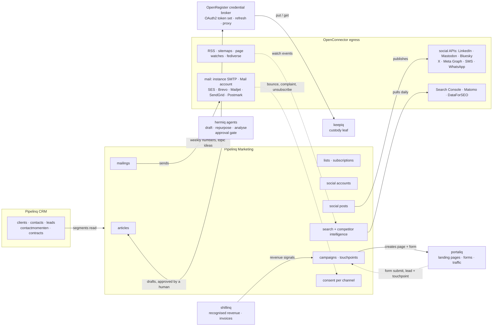

<!--
SPDX-License-Identifier: EUPL-1.2
SPDX-FileCopyrightText: 2026 Conduction B.V.
-->

# Marketing architecture

This page records how the Marketing section of Pipelinq grows from email blasts into a marketing suite: lists and mailings the tenant owns, a content hub, corporate and personal social accounts, campaigns with attribution, and search and competitor intelligence. It is the technical companion to the [marketing feature page](../Features/marketing.md) and the [blast user guide](../user/marketing-blasts.md).

The plan behind it was set on 2026-09-04 after a market survey and a twenty-question intake. The decisions are listed at the end of this page so that later specs start from them instead of re-asking.

## What exists today

Pipelinq already ships a compliant blast engine. Everything below is live in the `pipelinq` register.

| Capability | Where | Spec |
| --- | --- | --- |
| Six schemas: `segment`, `campaignTemplate`, `blast`, `blastDelivery`, `consentRecord`, `attributionLink` | `lib/Settings/register.d/95-marketing-segmentation-blast.json` | marketing-segmentation |
| Rule-tree segments evaluated live at send time | `SegmentService` | marketing-segmentation |
| Consent gating, unsubscribe token and postal address required in email templates | `ComplianceService` | marketing-compliance |
| Send through an OpenConnector send-mail source, per-source rate limit, deterministic A/B split | `BlastService`, `BlastSendJob` | marketing-blast, marketing-blast-delivery |
| First-party open pixel and click redirect with HMAC tokens | `TrackingLinkService`, `BlastTrackingController` | marketing-email-tracking |
| Provider webhooks for bounce, complaint and unsubscribe | `BlastWebhookController` | marketing-blast-delivery |
| Revenue attribution from first click to a won lead | `AttributionService` | marketing-blast |
| Campaigns that own the UTM vocabulary, landing pages created in portaliq, touchpoint attribution in three models closed on a paid invoice or a won lead | `CampaignService`, `LandingPageProvisioningService`, `TouchpointService`, `CampaignAttributionService`, `CampaignReportService` | marketing-campaigns |
| Performance dashboard with a chi-square A/B verdict | `BlastPerformanceDashboardView` | marketing-analytics |
| SMS and WhatsApp messaging with per-channel consent and budgets | `80-whatsapp-sms-channel.json` | outbound-messaging |

Two defects are known and are the first work of phase 1. The segment builder component is imported by nothing, so the Segments and Templates pages the user guide describes are not reachable. Segment validation fails on current OpenRegister because `SegmentService` still passes a removed `$published` argument to `SchemaMapper::find()` (pipelinq#773).

## Five rules

Every phase below is designed against these rules. A change that breaks one of them is wrong even when it works.

1. **Unsubscribes and clicks are ours.** Every mailing carries a Pipelinq unsubscribe URL and Pipelinq click redirects, whatever transport sends it. A provider's own unsubscribe is mirrored back through its webhook and never relied on.
2. **No secret on an object.** Social tokens, provider keys and Google credentials are `credentialRef` values resolved through the OpenRegister credential broker into keepiq (ADR-064). Pipelinq never stores a token.
3. **One egress plane.** Every call to a network, provider or search API runs through an OpenConnector source (ADR-067, ADR-091). Pipelinq writes adapters that shape requests, not HTTP clients.
4. **Agents propose, people dispose.** Hermiq drafts and analyses. A send or a publish is a gated action with a recorded human decision and an agent-authored mark (ADR-088). The marketing agent has no send or publish tool at all.
5. **Money stays in shillinq, pages stay in portaliq.** Pipelinq reads recognised revenue and creates landing pages through the portal contribution contract. It does not book revenue or render public pages itself (ADR-107, ADR-086).

## Components



Solid arrows into the egress box leave the instance. Dotted arrows are inbound signals that land on Pipelinq objects. The click redirect and unsubscribe endpoints are Pipelinq's own, so the tenant keeps that data even when a bulk provider does the sending.

## How a mailing travels

```mermaid
flowchart LR
  render[render<br/>links wrapped, UTM added<br/>pixel only if enabled<br/>List-Unsubscribe headers]
  smtp[instance SMTP<br/>IMailer, default]
  account[sender's Mail account<br/>low volume]
  provider[bulk provider<br/>OpenConnector source]
  recipient[recipient]
  click["/track/click/{token}<br/>records the click, redirects"]
  unsub["/lists/unsubscribe/{token}<br/>one click, subscription withdrawn"]
  hook["/blast-webhooks/{provider}<br/>bounce and complaint to consent"]

  render --> smtp --> recipient
  render --> account --> recipient
  render --> provider --> recipient
  recipient --> click
  recipient --> unsub
  provider -.-> hook
```

The transport is a per-tenant choice. The three endpoints on the right never change. They are `PublicPage` routes with signed tokens, throttled per ADR-082, and they fail closed.

The Nextcloud `IMessage` interface has no header setter. Setting `List-Unsubscribe` and `List-Unsubscribe-Post` on the default transport needs either the private `Message::getSymfonyEmail()` or a Symfony `Email` sent through the same transport DSN. Phase 0 decides which and records it in its spec.

## How a tenant connects an account

Every network except Bluesky keeps an exact-match allow-list of callback URIs. A tenant's own domain cannot be the callback of a Conduction-owned developer app. The broker therefore runs a relay: one registered callback on a Conduction host reads the tenant and a nonce from `state`, validates them server-side, and hands the authorization code to the tenant's instance. A tenant may also bring its own client ID, in which case the tenant's own callback is registered and no relay is used.

| Network | Callback rule | Limit | Consequence |
| --- | --- | --- | --- |
| Meta | Exact match, strict mode, `state` is the only free parameter | none published | Relay. Business Verification and Tech Provider verification are done once by the app owner. |
| LinkedIn | Exact match, query arguments ignored | a handful | Relay. The Community Management API is built for agencies managing clients' pages. |
| X | Exact match including trailing slash | 10 per app | Relay. |
| Google | Exact match | 100 per client | Relay for uniformity. A service account added as a Search Console user skips the consent screen entirely and is the first choice for public-sector tenants. |
| Bluesky | Client publishes its own metadata JSON | none | No relay. The tenant's Nextcloud can be its own client. |
| Mastodon | App registered per instance at connect time | none | No relay. |

The broker's connection model follows Nango's shape with Merge's status vocabulary. One connection per tenant, provider and account: identity, scopes, encrypted access and refresh token with expiry in keepiq, status `pending`, `active`, `expired`, `relink_needed` or `disabled`, last refresh and last error. Refresh runs on read when the margin has passed and on a daily job for every active connection, under a per-connection lock, written atomically. A failed refresh flips the status to `relink_needed`, keeps the row, notifies the owner, and re-authorisation overrides the same id so every `socialAccount` that points at it keeps working. Nango is Elastic License 2.0: copy the shape, never the code.

## Data model

All schemas are OpenRegister configuration in `lib/Settings/register.d/`, following the existing `95-marketing-segmentation-blast.json` fragment. Logic the schema grammar cannot express (double opt-in state, OAuth connect, daily pulls) lives in services, per ADR-031.

### New schemas

| Schema | Purpose | Key properties | Phase |
| --- | --- | --- | --- |
| `article` | The content hub object | title, slug, summary, body (markdown), heroImage, links[], tags[], language, status, author, publishedAt, portalPageRef, agentAuthored | 2 |
| `mailingList` | An opt-in container a person subscribes to | name, description, optInMode (double, soft), senderName, senderEmail, replyTo, publicSignup, footerAddress | 1 |
| `subscription` | Membership of one contact in one list | listId, contactId, email, state (pending, confirmed, unsubscribed, bounced), source, lawfulBasis, confirmToken (writeOnly), confirmedAt, unsubscribedAt, reason | 1 |
| `mailing` | A composed newsletter | name, listIds[], segmentId, templateId, articleIds[], subject, preheader, transport, scheduledFor, campaignId, blastId | 1 |
| `mailTransport` | A per-tenant sending route | kind (instance, mailAccount, provider), connectorSourceId, mailAccountRef, dailyLimit, dkimVerified, dmarcStatus, active | 1 |
| `socialAccount` | A connected corporate or personal profile | network, kind (organisation, person), handle, profileUrl, ownerUserId, clientId, credentialRef, scopes[], status, publishMode (api, share), followerCount | 3 |
| `socialPost` | One piece of content for one or more accounts | articleId, campaignId, body, media[], link, accountIds[], scheduledFor, status, approvals[], variants, agentAuthored | 3 |
| `socialPublication` | The per-account result of a post | postId, accountId, externalId, url, publishedAt, metrics (views, likes, comments, shares, clicks), metricsAt, cost | 3 |
| `socialConnection` | Who follows whom | accountId, counterpartHandle, counterpartClientId, direction, seenAt | 5 |
| `campaign` | The umbrella that carries attribution | name, goal, utmCampaign, mailingIds[], postIds[], landingPageRef, formRef, startsAt, endsAt, budgetEur, attribution | 4 |
| `touchpoint` | One attributable interaction | contactId, leadId, campaignId, channel, utm, occurredAt, kind (click, visit, submit, reply) | 4 |
| `searchProperty` | A connected Search Console property or Matomo site | kind, siteUrl, credentialRef, lastPulledAt, status | 5 |
| `searchQueryStat` | One Search Console row per day | propertyId, date, query, page, clicks, impressions, ctr, position, country, device | 5 |
| `keywordTarget` | A keyword to win or to stop chasing | term, intent, targetPageRef, status (use more, use less, watch), volume, difficulty | 5 |
| `competitor` | An organisation to watch | name, website, feeds[], sitemapUrl, socialHandles[], clientId, notes | 5 |
| `competitorWatch`, `watchEvent` | What to poll and what changed | competitorId, kind (rss, sitemap, page, fediverse, search), target, schedule; event: title, url, diffSummary, seenAt, relevanceScore | 5 |

### Extensions to existing schemas

- `contact` and `client` gain typed `emails[]`, `phones[]` and `socialProfiles[]` (network, handle, url, verified, followedByUs, followsUs), plus `preferredChannel`, `timezone` and `language`. The single `email` and `phone` stay as primary values so nothing downstream breaks.
- `consentRecord` gains `listId` and `evidence`, so a list subscription and a channel consent are one ledger. Soft opt-in gets its own `lawfulBasis` value with the objection offered recorded.
- `blast` gains `mailingId`, `transportId` and `campaignId`. A blast becomes the send instance of a mailing; the wizard, monitor and dashboard keep working.
- `attributionLink` gains `campaignId`, `touchpointIds[]`, `invoiceRef` and `model`, so attribution can close on a paid shillinq invoice instead of a won lead.
- `lead` gains `firstTouch` and `lastTouch` UTM blocks written at form submission.

## Phases

Phases are ordered by value and dependency. No dates. Tracks inside a phase can be built in parallel. Each phase names the openspec changes to open and the exit criterion that lets the next one start.

| Phase | Scope | Openspec changes | Exit criterion |
| --- | --- | --- | --- |
| 0 · Platform prerequisites | OAuth2 token-set kind with refresh in the OpenRegister broker, connect relay, a header path for RFC 8058 on IMailer, a landing-page action on the portaliq contribution contract, Matomo in the dev compose | `credential-oauth2-token-set`, `credential-oauth2-connect-flow` (openregister), `contribution-landing-page-action` (portaliq), Matomo profile (.github), ADR-064 amendment (hydra) | A unit test mints and refreshes a token set against a mock and sends an IMailer message with both headers; a portaliq page exists that Pipelinq created |
| 1 · Lists and mailings | Segment UI repair, mailing lists with mandatory double opt-in, preference centre, RFC 8058 headers, transports (instance SMTP default, Mail account, five providers), newsletter composer, typed contact channels | `marketing-segments-ui-repair`, `marketing-lists-and-double-opt-in`, `marketing-mail-transports`, `marketing-rfc8058-headers`, `marketing-newsletter-composer`, `contact-channel-details` | Conduction's newsletter goes out through the instance SMTP to double opt-in subscribers with first-party clicks, and an SES bounce lands as withdrawn consent |
| 2 · Content hub and hermiq | `article` objects with a markdown editor, the Conduction writing skill exported to hermiq, a marketing agent template without send or publish tools, repurpose actions, companion context | `marketing-article-hub`, `marketing-agent-template` (hermiq), `writing-skill-agentskills-export` (hydra), `marketing-companion-context` | A marketer writes an article, asks for a LinkedIn variant and a newsletter intro, and both appear as agent-marked drafts in the composers |
| 3 · Social publishing | Account connection through the broker, seven adapters behind one interface (Mastodon, Bluesky, LinkedIn member and page, X with a spend cap, Facebook page, Instagram business, Threads), composer and calendar with approvals, advocacy share flow, daily metrics pull, read-only inbox | `social-publishing` (built as ONE change rather than the eight below, because the adapters share an interface, a broker seam and a failure vocabulary that would have been written three times over eight changes); read-only inbox deferred to phase 5 | A post drafted from an article is approved and published to a company page, a colleague's profile and Mastodon at the scheduled time, and shows views the next morning |
| 4 · Campaigns and attribution | Campaign object with a fixed UTM vocabulary, landing pages and forms in portaliq, form submit to lead with first and last touch, attribution models, attribution closed on paid invoices, one campaign report | `marketing-campaigns-and-utm`, `marketing-landing-pages-via-portaliq`, `marketing-touchpoint-attribution`, `shillinq-attribution-on-paid-invoice` (shillinq), `marketing-campaign-report` | A lead created from a landing-page form shows the mailing as first touch, a post as last touch, and an attributed value once shillinq records the invoice as paid |
| 5 · Search and competitor intelligence | Search Console and Matomo connectors, first-party keyword analysis (position buckets, striking distance, cannibalisation, content gaps), DataForSEO bring-your-own-key, competitor watches on OpenRegister flow schedules, connection audit | `search-console-and-matomo-connectors`, `keyword-intelligence`, `competitor-watches`, `social-connection-audit` | The keyword page lists striking-distance queries from real Search Console data; the competitor page shows the last ten items three competitors published |
| 6 · Integrated campaigns | Shillinq signals as segment fields, standard audiences, journeys as OpenRegister flows, weekly review agent, suppression rules | `marketing-integrated-campaigns` (built as ONE change rather than the four below, because the signals, the audiences and the suppression rule are the same eight derived fields read from three places, and splitting them would have written that catalogue three times) | A win-back journey starts from a "no invoice in 12 months" signal and the Monday review names its result |

Phase 6 shipped as one change, `marketing-integrated-campaigns`, on 2026-09-05. What resolves today and what waits:

| Signal | State | What it waits on |
| --- | --- | --- |
| Days to contract renewal, days a lead has been stalled | Resolves on every instance | Nothing. Both read pipelinq's own contracts and leads. |
| Recognised revenue, value tier, months since the last invoice, purchased products and services, dunning state | Derived and asserted, and resolves to nothing against the demo data | Shillinq, plus a real `client.shillinqOrganisationRef`. Every seeded client carries a nil-UUID placeholder, so the six bookkeeping signals correctly answer "no bookkeeping" even where shillinq is installed. An unresolved signal makes an audience smaller, never larger. |
| A journey's wait, condition and schedule | Compiled and published to OpenRegister's flow engine | Nothing on an instance whose OpenRegister carries the flow engine. Where it does not, the journey records `engine_missing` and stays inert; pipelinq ships no scheduler of its own. |
| The weekly review's competitor half | Absent | Phase 5's `watchEvent` collection, which is not on `development`. The review lists `watchEvent` under `degraded` and draws its topic ideas from search queries instead. |
| The weekly review's narrative | Composed by pipelinq, written by an agent when there is one | Hermiq. The agent template is seeded into hermiq's register when hermiq is installed and is a silent no-op otherwise. It grants read-only tools: no send tool, no publish tool. |

External filings gate phase 3 by calendar, not by code: the LinkedIn Community Management application, Meta App Review with Business Verification, and an X developer account with billing. They are filed under Conduction at the start of the programme.

Phase 3 shipped as one change, `social-publishing`, on 2026-09-05. What is provable today and what waits:

| Network | State | What it waits on |
| --- | --- | --- |
| Mastodon | Provable end to end | Nothing. An application is registered at the account's own server at connect time. |
| Bluesky | Adapter written and asserted; connection mintable; publish refused by the PDS | OpenRegister's DPoP proof layer (`credential-oauth2-bluesky-dpop`). The catalogue ships `bluesky` flagged `preview`, and Pipelinq mirrors that as a `preview` readiness rather than blocking it. |
| LinkedIn | Adapter written and asserted against the documented API | A Conduction developer application; company page posting also needs Community Management approval. |
| X | Same, plus a hard-stop spend budget on `messageSendBudget` | A developer account with billing. |
| Facebook page, Instagram business | Same | Meta App Review with Business Verification. |
| Threads | Same | A `threads` provider in OpenRegister's credential catalogue. There is none, so the adapter reports `not_configured` with a reason rather than failing at the call. |

## Decisions

Taken on 2026-09-04. Later specs start here.

| Topic | Decision |
| --- | --- |
| Audience | Conduction itself, MKB and public sector from day one; tenant-agnostic design |
| Home | Extend Pipelinq's Marketing section; a separate app is not ruled out later |
| Timeline | Multi-year, no dates; phases carry order and exit criteria |
| Mail transport | Instance mail server is the default; the sender's Mail account and bulk providers are per-tenant options |
| Bulk providers | Amazon SES, Brevo or Mailjet, SendGrid, Mailgun, Postmark |
| Opt-in | Double opt-in mandatory for self-service subscribe; soft opt-in for existing customers recorded with its ground |
| Content | One `article` object reused by newsletter, social and portaliq |
| Networks | LinkedIn page and member, Mastodon, Bluesky, X, Facebook Pages, Instagram Business, Threads |
| Spokespersons | Connect-and-publish where the API allows; share-from-prepared-post elsewhere. Personal Facebook and Instagram accounts cannot be posted to via API at all |
| Credentials | ADR-064: OpenRegister broker, keepiq custody; the broker gains an OAuth2 token-set kind with refresh |
| Developer apps | Conduction-owned by default, bring-your-own app IDs per tenant |
| Search data | Google Search Console and Matomo first; GA4 and Bing optional; DataForSEO bring-your-own-key later |
| Competitors | Lightweight in Pipelinq on OpenRegister flows; no LinkedIn or Meta scraping |
| AI autonomy | Draft and analyse freely; never send or publish without human approval |
| Shillinq | Value tiers and lapsed customers, purchase history, attribution closed on paid invoices |
| Portaliq | Pipelinq creates and links landing pages through the contribution contract; forms per ADR-085 |
| Tracking | Click tracking on and open pixel off by default; both per-tenant toggles |

## Risks

| Risk | Mitigation |
| --- | --- |
| The OAuth2 broker work in openregister takes longer than phases 1 and 2 | Phase 0 starts first and in parallel; fediverse adapters are built against a mock broker |
| LinkedIn Community Management approval takes months and needs a legal entity | File at the start; ship member posting first; the advocacy flow covers pages meanwhile |
| Meta App Review and Business Verification | Conduction files early; bring-your-own app IDs let a tenant proceed on its own review |
| X pay-per-use pricing | Spend budget per tenant with a hard stop, reusing `messageSendBudget` semantics |
| Callback allow-lists (X and TikTok cap at 10, Google at 100) | Relay callback with a signed `state`; tenant BYO client as the sovereign path |
| Google clients in testing status lose refresh tokens after 7 days | Service account as a property user is the first-class path; Conduction verifies its own client once |
| Nextcloud IMailer has no public header API | Phase 0 decides the header path; provider transports carry headers natively |
| Gmail and Yahoo bulk sender rules | Deliverability panel checks SPF, DKIM and DMARC; one-click unsubscribe; complaint webhooks withdraw consent |
| Meta and LinkedIn deprecate metrics (reach and impressions gone June 2026) | Normalise to views, likes, comments, shares, clicks; store the raw payload alongside |
| Competitor social data is unobtainable legitimately | Scope stated up front: feeds, sitemaps, pages, fediverse, search |
| Public-sector tenants forbid third-party trackers | Matomo and portaliq traffic analytics are first-party; pixel off by default |

## References

- ADRs in `hydra/openspec/architecture/`: 031 (declarative business logic), 034 (AI chat companion), 046 (portal contribution contract), 064 (credential custody), 067 (shared egress plane), 082 (public endpoint throttling), 085 (forms and journeys), 086 (portaliq headless CMS), 088 (agent-authored artefacts are marked), 091 (external API surface belongs to OpenConnector), 094 (automation targets the OpenRegister flow engine), 107 (money has one home), 108 (public surface placement), 112 (reports are one page).
- Google bulk sender requirements: https://support.google.com/a/answer/14229414
- RFC 8058 one-click unsubscribe: https://www.rfc-editor.org/rfc/rfc8058
- Telecommunicatiewet changes per 1 July 2026: https://www.holla.nl/nieuws/telemarketing-alleen-nog-met-toestemming-ingrijpende-wijziging-per-1-juli-2026
- Meta Facebook Login for Business: https://developers.facebook.com/docs/facebook-login/facebook-login-for-business/
- LinkedIn Community Management API: https://learn.microsoft.com/en-us/linkedin/marketing/community-management/community-management-overview
- X developer apps and callback limits: https://docs.x.com/fundamentals/developer-apps
- AT Protocol OAuth: https://atproto.com/specs/oauth
- Search Console API limits: https://developers.google.com/webmaster-tools/limits
- Matomo campaign reporting plugin: https://github.com/matomo-org/plugin-MarketingCampaignsReporting
- Nango token refresh (reference shape, Elastic License 2.0): https://nango.dev/docs/guides/auth/token-refreshing
