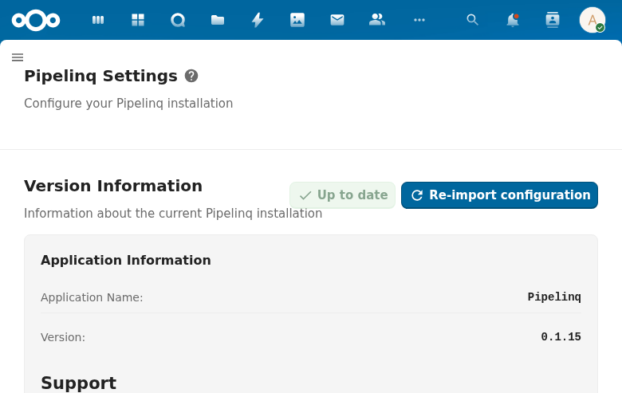

# Administration

Nextcloud admin panel for configuring Pipelinq, plus the foundational OpenRegister integration that stores all CRM data.

## Screenshot

The Pipelinq admin settings page at `/settings/admin/pipelinq` shows:
- **Version Information**: Application name (Pipelinq), version (0.1.15), "Up to date" status badge, and "Re-import configuration" action button
- **Support**: Links to support@conduction.nl and sales@conduction.nl
- **Register Configuration**: Maps 8 Pipelinq object types (Client, Contact, Lead, Request, Pipeline, Product, Product Category, Lead Product) to OpenRegister schemas, with register selector dropdown showing "Pipelinq" register. Shows "8/8 configured" status.
- **Pipelines**: Pipeline CRUD with "Add pipeline" and "Create first pipeline" actions
- **Product Categories**: Category management with "+ Add Category"
- **Lead Sources**: Source value configuration with "+ Add Source"
- **Request Channels**: Channel configuration with "+ Add Channel"
- **Prospect Discovery**: ICP (Ideal Customer Profile) configuration section

## Specs

- `openspec/specs/admin-settings/spec.md`
- `openspec/specs/openregister-integration/spec.md`

## Features

### Nextcloud Admin Panel (MVP)

Pipelinq registers a settings section in Nextcloud's admin panel, accessible to administrators for configuration.

- Register status display (shows OpenRegister connection health)
- Re-import configuration action (reloads schemas from config file)

### Pipeline Management (MVP)

Full CRUD for pipelines and their stages from the admin panel:

- Create, edit, and delete pipelines
- Add, reorder, and remove stages within pipelines
- Set default pipeline (exactly one pipeline marked as default)
- Drag-and-drop stage reordering

### Default Pipelines on Installation (MVP)

Two default pipelines are created automatically during app installation via the repair step:

- **Sales Pipeline** (default): New -> Contacted -> Qualified -> Proposal -> Negotiation -> Won -> Lost
- **Service Requests**: New -> In Progress -> Completed -> Rejected -> Converted

### Register Configuration (MVP)

Maps Pipelinq object types to OpenRegister registers and schemas. The admin UI displays all 8 object types with their schema assignments and register selection dropdown.

### Settings Persistence (MVP)

All configuration is stored in Nextcloud's IAppConfig and survives app updates and server restarts.

### OpenRegister Integration (MVP)

Pipelinq owns no database tables -- all data is stored as OpenRegister objects in the `pipelinq` register with 8 schemas:

- `client` -- Person or organization
- `contact` -- Contact person linked to a client
- `lead` -- Sales opportunity
- `request` -- Service/intake request
- `pipeline` -- Configurable workflow board with stages
- `product` -- Product or service in the catalog
- `productCategory` -- Product category for grouping
- `leadProduct` -- Product line item linked to a lead

### Auto-Configuration on Install (MVP)

The repair step (`InitializeSettings`) automatically:

1. Checks if OpenRegister is available (skips gracefully if not installed)
2. Imports the register configuration from `pipelinq_register.json`
3. Creates default pipelines
4. Ensures system tags are set up

### Pinia Store Pattern (MVP)

A generic object store (`useObjectStore`) manages all entity types through a single Pinia store. Features:

- CRUD operations: `fetchCollection`, `fetchObject`, `saveObject`, `deleteObject`
- Structured error objects with HTTP status distinction (404, 403, 422, 500)
- 422 validation error parsing with field-level feedback
- Batched reference resolution (`resolveReferences`) to avoid N+1 queries
- Pagination support
- Object caching

### Error Handling (MVP)

Comprehensive error handling across the frontend:

- Structured errors: `{ message, status, fields }` instead of plain strings
- List views: inline error display with retry button (`NcNoteCard`)
- Detail views: error toasts on save/delete failures (`showError`)
- Form preservation: form data stays intact when save fails
- Network error detection and user-friendly messaging

### RBAC Integration (MVP)

All data access respects OpenRegister's role-based access control. Dashboard data and entity lists are scoped to the user's permissions.

### Audit Trail (MVP)

OpenRegister automatically tracks who created/modified objects and when, providing full audit trail without additional Pipelinq code.

### Planned (V1)

- Lead source value configuration (admin-customizable dropdown values)
- Request channel value configuration
- NL Design System theming support

### Planned (Enterprise)

- Priority label/color customization
- Field-level access control
