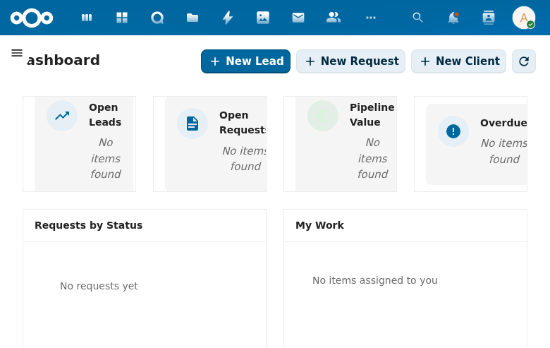

# Dashboard

Landing page providing an at-a-glance CRM overview with KPI cards, charts, activity previews, and quick actions.

## Screenshot

The dashboard displays four KPI cards (Open Leads, Open Requests, Pipeline Value, Overdue), a Requests by Status summary, and a My Work preview. Quick action buttons for creating leads, requests, and clients are prominently placed in the header.

## Specs

- `openspec/specs/dashboard/spec.md`

## Features

### KPI Cards (MVP)

Top row of metric cards showing key CRM numbers at a glance:

- Open Leads (count of non-terminal leads)
- Open Requests (count of non-terminal requests)
- Pipeline Value (total EUR value of active pipeline items)
- Overdue (count of items past their due date)

### Requests by Status Chart (MVP)

Visual chart showing the distribution of requests across status values (new, in_progress, completed, rejected, converted).

### My Work Preview (MVP)

Compact preview of the user's assigned items (top 5), linking to the full My Work view. Shows priority, due date, and entity type.

### Quick Actions (MVP)

Shortcut buttons for common operations: create new lead, create new request, create new client. These appear as prominent colored buttons in the dashboard header bar.

### Dashboard Data Refresh (MVP)

Dashboard data refreshes on mount and supports manual refresh via the refresh button. Data scoped to user's RBAC permissions.

### Empty State Handling (MVP)

Fresh installations show a welcoming empty state with getting-started guidance instead of empty charts.

### Product Revenue KPI Card (V1)

Shows top 3 products by total pipeline value based on lead-product line items. Displays "No product data yet" when no line items exist.

### Products Count KPI Card (V1)

Displays total count of active products as a KPI card in the top row.

### Prospect Discovery Widget (V1)

Dashboard widget showing top 10 prospects based on ICP configuration. Features:
- Prospect cards with company name, fit score, SBI, employees, city, KVK number
- "Create Lead" action to convert prospect to client + lead
- Setup prompt when ICP is not configured
- Manual refresh to clear cache and re-fetch

### Planned (V1)

- Pipeline funnel visualization (conversion between stages)
- Leads by source chart (marketing attribution)
- Recent activity feed (last 10 CRM events from activity stream)
- Dashboard role-based views (different layouts per role)

### Planned (Enterprise)

- Custom dashboards
- Advanced charts (trends, forecasting)
