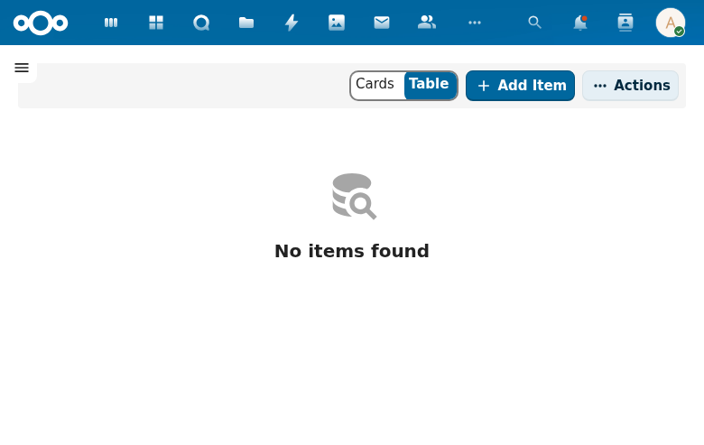

# Product Catalog

Manages the products and services an organization sells, enabling accurate pipeline valuation through product-based pricing on leads.

## Screenshot

The product catalog list view uses the same Cards/Table interface as other entity views. Products can be created, searched, sorted, and filtered. The "Add Item" button creates new products, and the Actions menu provides bulk operations.

## Specs

- `openspec/specs/product-catalog/spec.md`
- `openspec/specs/lead-product-link/spec.md`
- `openspec/specs/product-catalog-quoting/spec.md`

## Features

### Product CRUD (V1)

Full create, read, update, and delete for product records stored as OpenRegister objects with `schema:Product` type annotation.

Key properties:
- `name` -- Product or service name (required)
- `description` -- Detailed description
- `sku` -- Stock Keeping Unit identifier
- `price` -- Base price in EUR
- `currency` -- Currency code (default: EUR)
- `isActive` -- Whether the product is available for selection
- `category` -- Link to product category

### Product Categories (V1)

Hierarchical grouping of products. Categories are managed via the admin settings page with "+ Add Category" action. Each category has a name and optional parent for nesting.

### Lead-Product Link (V1)

Attach specific products (with quantities and pricing) to leads, replacing manual value entry:

- Line items with product reference, quantity, unit price, and total
- Lead value auto-calculated from product line items
- Auditable breakdown of what makes up a lead's value

### Planned (Enterprise) -- Quoting

Extended product catalog with quote generation:

- Line items with quantities and discounts
- Quote lifecycle management (draft, sent, accepted, rejected)
- PDF proposal generation
- Tax calculation
- For government: pricing proposals for services and leges calculations
